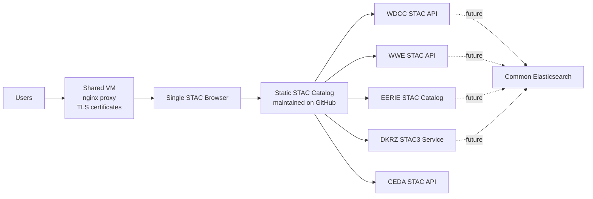

# demo-stac-catalog

Static STAC catalog for demos. The catalog is intended to be served as plain
static files and used as the default catalog URL in an existing STAC Browser
deployment.

## Catalog entrypoint

Open the catalog in the public STAC Browser:

[View in STAC Browser](https://radiantearth.github.io/stac-browser/#/external/https%3A%2F%2Fraw.githubusercontent.com%2Fcehbrecht%2Fdemo-stac-catalog%2Fmain%2Fpublic%2Fcatalog%2Fcatalog.json)

Use this raw GitHub URL as the public STAC Browser catalog URL:

```text
https://raw.githubusercontent.com/cehbrecht/demo-stac-catalog/main/public/catalog/catalog.json
```

After GitHub Pages is enabled for this repository, you can also use:

```text
https://cehbrecht.github.io/demo-stac-catalog/catalog/catalog.json
```

When served locally from its `public` directory, use:

```text
http://localhost:8080/catalog/catalog.json
```

For another static host, use the equivalent hosted URL:

```text
https://<host>/<path>/catalog/catalog.json
```

The root catalog currently links to:

- CEDA STAC API: <https://api.stac.ceda.ac.uk/>
- DKRZ Internal STAC Services: `public/catalog/dkrz/catalog.json`

Catalog entries include local PNG icon and preview images in `public/catalog/assets/`.
External services are represented by small local wrapper catalogs so STAC Browser
can show those icons before navigating onward to the remote service.

The DKRZ catalog currently links to:

- WDCC STAC API: <https://www.wdc-climate.de/ui/stac/v1>
- WWE STAC API: <https://wwestac.cloud.dkrz.de/stac-fastapi-es/>
- EERIE STAC Catalog: <https://eerie.cloud.dkrz.de/stac-catalog-all.json>
- DKRZ STAC3 Service: <http://stac3.cloud.dkrz.de/stac/>

## Add internal DKRZ STAC APIs

Edit `public/catalog/dkrz/catalog.json` and add one `child` link per internal
service:

```json
{
  "rel": "child",
  "type": "application/json",
  "title": "DKRZ Example STAC API",
  "href": "https://internal.example.dkrz.de/stac/"
}
```

The `href` can point to a STAC API landing page, another static catalog, or a
collection JSON document.

## STAC Browser config

If your STAC Browser reads a runtime config file, `public/config/stac-browser.config.example.js`
shows the intended setting:

```js
window.STAC_BROWSER_CONFIG = {
  catalogUrl: "./catalog/catalog.json"
};
```

If STAC Browser is served separately from this catalog, use the absolute hosted
catalog URL instead of the relative path:

```js
window.STAC_BROWSER_CONFIG = {
  catalogUrl: "https://raw.githubusercontent.com/cehbrecht/demo-stac-catalog/main/public/catalog/catalog.json"
};
```

## Local static server

For local demos with STAC Browser running on a different port, use the included
CORS-enabled static server:

```sh
python3 scripts/serve.py
```

Then configure STAC Browser to open:

```text
http://127.0.0.1:8080/catalog/catalog.json
```

If STAC Browser and the catalog are served from the same host, any static server
also works. For example:

```sh
python3 -m http.server 8080 --directory public
```

## Future plans

Currently, several project-specific instances and VMs run their own complete
STAC setup, including their own STAC Browser deployment.



The next step is to consolidate this into one shared VM that provides:

- nginx as the public proxy
- TLS certificate handling
- one shared STAC Browser instance
- a static GitHub-maintained catalog of available STAC services

This repository is intended to become that maintained static catalog. STAC
services can stay project-specific, but discovery and browsing should happen
through the shared STAC Browser entrypoint.

In a later step, the services may also use a common Elasticsearch instance for
shared indexing and search infrastructure.
